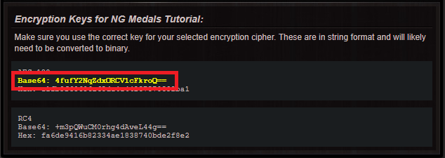

Hello ! Today, I’m going to try to teach you something : how to use the Newgrounds Medals system with your PICO-8 game. 

/!\ I'm going to explain you how I've setup medals for my game, Rush. I haven't used all the possibilities of the medals, therefore the system can be improved. But as a basic integration, this is very good! /!\

## What do you need?

- PICO-8 (of course)
- The [Newgrounds.io Javascript API](https://bitbucket.org/newgrounds/newgrounds.io-for-javascript-html5)
- A text editor (For this guide, I'm going to use [Brackets](http://brackets.io/))
- Your own account on Newgrounds

## Setup

The first things you have to do is to download the Newgrounds.io Javascript API ([Download here](https://bitbucket.org/newgrounds/newgrounds.io-for-javascript-html5/downloads/)). Open the `.zip` and drag the `src` and the `bin` in a new folder.


*__Fig 1 :__ The content of the `.zip` you download*


*__Fig 2 :__ The file you need to drag on your new folder*

## On PICO-8

You have your game on PICO-8. For the transfer, we are going to use the GPIO system (if you don't know how it's working, you can read the [Sean explanation](https://www.lexaloffle.com/bbs/?tid=3909), but don't worry, I'm going to explain how to simply use it here).

So in PICO-8 you can use 128 pin which can get a value between 0 and 255. Normaly it's for the Raspberry Pi and the Pocketchip, but you can get it too thanks to Javascript! You have to poke value on the adress from 0x5f80 to 0x6000. We are going to setup two small functions, that way it'll be easier to peek and poke the value.

```Lua
function set_pin(pin,value) --pin : pin between 0 and 127
	poke(0x5f80+pin, value) --value : the value between 0 and 255
end

function get_pin(pin) --pin : the pin do you want to get the value
	return peek(0x5f80+pin)
end
```

The methode I've use is not the best one or the most optimised but it's working and it's not that bad!

We are going to setup a second function, with this function you can ask to the API to unlock a new function. We are going to use the pin "0" to say we need to unlock a medals, and the pin 1 to say which medal we want to unlock. I use 2 pin because if you want to create another system, like a sharable score, you can change the value of the pin 0 so you don't have conflicts with that.

So the function is very simple :

```Lua
function unlock_medals(num) --num : the number of the medals we are
	set_pin(0,1)			--going to combine the number and the medals
	set_pin(1,num)			--ID with Javascript
end
```

Now, we are going to setup the Unlock Medals sound and visual effect in PICO-8. We are going to use the pin 0 for the trigger and the pin 1 for the number of the medals.

Let us setup a function to detect that. You have to put it in the `_update` function.

```Lua
function test_medals()	
	if get_pin(0)==2 then --trigger
		set_pin(0,0) --reset the trigger
		med_num=get_pin(1) --get the number of the medals
		med_tic=0 --set a tic, for the display function
		
		if med_num==1 then --if you had more medals, add it here
			med_inf={122,"easy finisher"}
		--[[
		elseif med_num==2 then
			med_inf={sprite to display, "name of the medals"} ]]
		end
	end
end
```

The `med_inf` variable contains the information about the medals, this information can be use in the next function, the `draw_medals` function. You have to put this function in the last line of `_draw` function of PICO-8.

```Lua
function draw_medals()
	if med_num!=0 then --trigger
		med_tic+=1 --add 1 to the tic value
		rectfill(-1,116,10+#med_inf[2]*4,128,0) --draw a black background
		rect(-1,116,10+#med_inf[2]*4,128,5)	--draw a gray square
		spr(med_inf[1],1,118) --draw the sprite who represent the medals
		print(med_inf[2],10,120,5) --print the medals' name
		
		if med_tic>=70 then --reset. you can change the duration here
			med_num=0 --reset
		end
	end
end
```

We just need a last function, to "init" the variable. Put it in the `_init` function.

```Lua
function init_medals()
	med_num=0
	med_tin=0
end
```

For the test, we are going to setup a basic interaction to test the medals. When you press the ❎ button, we unlock a new medal. So all of our PICO-8 Code is :

```
--basic medals tutorial
--by bigaston

function _init()
	init_medals()
end

function _update()
	if btnp(❎) then
		unlock_medals(1)
	end
end

function _draw()
	cls()
	print("press ❎ to unlock medals",1,1,7)
	draw_medals()
end

function set_pin(pin,value)
	poke(0x5f80+pin, value)
end

function get_pin(pin)
	return peek(0x5f80+pin)
end

function unlock_medals(num)
	set_pin(0,1)
	set_pin(1,num)
end

function init_medals()
	med_num=0
	med_tin=0
end

function test_medals()	
	if get_pin(0)==2 then
		set_pin(0,0)
		med_num=get_pin(1)
		med_tic=0
		
		if med_num==1 then
			med_inf={1, "yeah"}
		end
	end
end

function draw_medals()
	if med_num!=0 then
		med_tic+=1
		rectfill(-1,116,10+#med_inf[2]*4,128,0)
		rect(-1,116,10+#med_inf[2]*4,128,5)
		spr(med_inf[1],1,118)
		print(med_inf[2],10,120,5)
		
		if med_tic>=70 then
			med_num=0
		end
	end
end
```

Just copy this sprite in the first place of your sprite sheet :

```
[gfx]0808555555555bbbbbb55bbbbbb55bbbb7b55b7b7bb55bb7bbb55bbbbbb555555555[/gfx]
```

Or, you can just download the cartridge :  


To finish, just export the game in HTML5. After that, just copy your `.html` and `.js` file and it's done! You have finished the job with PICO-8!

## On Newgrounds

Now we are going to setup the game on Newgrounds to have access to the API. Create a new games [here](https://www.newgrounds.com/projects/games).

Now you have to complete the information about the game (as the picture, the description, ...). We will upload the games files later.

Jump to the **API Tool** line (on the left). Read and aprove the text. Now just click on `Click here to use the Newgrounds.io API for this game!`


*__Fig 3 :__ Where you have to click*

You have to get the App ID and the Base64 Encryption Keys.


*__Fig 4 :__ The App ID*


*__Fig 5 :__ The Encryption Keys*

Note it somewhere, you'll need it later. Now we are going to setup the medals. We have already made one medals in PICO-8 so we are going to add it on Newgrounds.

Go to `Medals` line under the `API Tools` line. Here you can setup the medals.

Add a new medals.


*__Fig 6 :__ Some medals information*

Click on Submit and take the Medals ID. If you want the medals to appear on the game's page, you have to unlock it once with your game.


*__Fig 7 :__ The Medal ID*

We have finish with Newgrounds for now. Now we need to use a text editor to edit the `.html` of the game.

## On the Text Editor

So! We have to edit the `.html` export by PICO-8. I'm going to share with you some premade code. You can find the Newgrounds part on the [bitbucket page of the Javascript API](https://bitbucket.org/newgrounds/newgrounds.io-for-javascript-html5).

We need to import the `newgroundsio.js` file. Add a line on the `<head>` part of your document. And you need the JQuery module.

```Javascript
<script src="https://ajax.googleapis.com/ajax/libs/jquery/3.1.0/jquery.min.js"></script>
<script src="bin/newgroundsio.js" type="text/javascript"></script>
```

Now I'm going to share you a premade code that you can use to enable medals. You can read the comment to understand how it's work. You just have to put this code on `<script>` section before this line : `<script async type="text/javascript" src="your_game.js"></script>`

```Javascript
var pico8_gpio = new Array(128); //Enable the PICO-8 GPIO

var ngio = new Newgrounds.io.core("NG App ID", "Base64 Encryption Keys");

function onLoggedIn() {
	console.log("Welcome " + ngio.user.name + "!");
}

function onLoginFailed() {
	console.log("There was a problem logging in: " . ngio.login_error.message );
}

function onLoginCancelled() {
	console.log("The user cancelled the login.");
}

/*
* Before we do anything, we need to get a valid Passport session.  If the player
* has previously logged in and selected 'remember me', we may have a valid session
* already saved locally.
*/
function initSession() {
	ngio.getValidSession(function() {
		if (ngio.user) {
			/* 
			* If we have a saved session, and it has not expired, 
			* we will also have a user object we can access.
			* We can go ahead and run our onLoggedIn handler here.
			*/
			onLoggedIn();
		} else {
			/*
			* If we didn't have a saved session, or it has expired
			* we should have been given a new one at this point.
			* This is where you would draw a 'sign in' button and
			* have it execute the following requestLogin function.
			*/
			requestLogin();
		}
	});
}

function requestLogin() {
	ngio.requestLogin(onLoggedIn, onLoginFailed, onLoginCancelled);
	/* you should also draw a 'cancel login' buton here */
}

function cancelLogin() {
	/*
	* This cancels the login request made in the previous function. 
	* This will also trigger your onLoginCancelled callback.
	*/
	ngio.cancelLoginRequest();
}

function logOut() {
	ngio.logOut(function() {
		/*
		* Because we have to log the player out on the server, you will want
		* to handle any post-logout stuff in this function, wich fires after
		* the server has responded.
		*/
	});
}
        
initSession();

/* vars to record any medals and scoreboards that get loaded */
var medals, scoreboards;

/* handle loaded medals */
function onMedalsLoaded(result) {
	if (result.success) medals = result.medals;
}

/* load our medals and scoreboards from the server */
ngio.queueComponent("Medal.getList", {}, onMedalsLoaded);
ngio.executeQueue();
        
/* You could use this function to draw the medal notification on-screen */
function onMedalUnlocked(medal) {
	console.log('MEDAL GET:', medal.name);
	if (medal.id==your medal ID) {
		pico8_gpio[1]=Your medals number (on PICO-8);
	}
    pico8_gpio[0]=2; //Enable the Trigger on PICO-8
}

function UnlockMedal(medal_id) {
	/* unlock the medal from the server */
	ngio.callComponent('Medal.unlock', {id:medal_id}, function(result) {

		if (result.success) onMedalUnlocked(result.medal);

	});
}
        
(function main(){
	if (pico8_gpio[0]==1) {
		pico8_gpio[0]=0;
    	if (pico8_gpio[1]==Your Medal Number) {
			UnlockMedal(Your Medal ID);
    	}
    }
}()) // call immediately to start the loop
```

Now you just have to rename your HTML file to `index.html`, create a ZIP Archive with your `.js` file, your `.html` file, the `bin` and `src` folder. Just upload the whole archive on Newgrounds and it's done! Just unlock the medals to validate it.

If you like this tutorial, you can [follow me on Twitter](https://twitter.com/Bigaston), visit [my Itch page](https://bigaston.itch.io).

[](https://ko-fi.com/A0A05WS6)

## Sources and thanks

- The Sean explanation of the PICO-8 GPIO ([here](https://www.lexaloffle.com/bbs/?tid=3909))
- The Newgrounds.io Javascript API, for the Javascript code ([here](https://bitbucket.org/newgrounds/newgrounds.io-for-javascript-html5))


